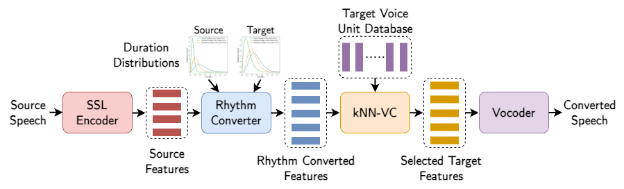

<!--
SPDX-FileCopyrightText: 2025 Idiap Research Institute
SPDX-FileContributor: Karl El Hajal

SPDX-License-Identifier: GPL-3.0-only
-->

# RnV: Unsupervised Rhythm and Voice Conversion Framework


[](https://arxiv.org/abs/2506.01618)
[](LICENSES/GPL-3.0-only.txt)



## Table of Contents
- [Installation](#installation)
- [Training](#training)
- [Conversion](#conversion)
- [Acknowledgements](#acknowledgements)
- [Citation](#citation)

## Installation

Install Poetry:
```bash
pip install poetry
```

Clone the repo and install the dependencies:
```bash
git clone git@github.com:idiap/rnv.git
cd rnv
poetry install
```

## Training

### Download speech dataset

LJSpeech example:
```bash
wget https://data.keithito.com/data/speech/LJSpeech-1.1.tar.bz2
tar -xvjf LJSpeech-1.1.tar.bz2
```

### Data preprocessing

TTS Data Preprocessing Example:
```bash
poetry run python scripts/preprocess_speech_data.py 16000 /path/to/dataset /processed/dataset/output/path
```

SSL Features Extraction Example:
```bash
poetry run python scripts/extract_dataset_embeddings.py wavlm /processed/dataset/output/path /processed/dataset/output/path
```

### Train Urhythmic Segmenter

```bash
poetry run python recipes/train_urhythmic_segmenter.py /path/to/feats/wavlm checkpoints/segmenter.pth 3
```

### Train Urhythmic Rhythm Model

```bash
poetry run python recipes/train_urhythmic_rhythm_model.py speaker_id global /path/to/feats/wavlm checkpoints/segmenter.pth path/to/save/output

poetry run python recipes/train_urhythmic_rhythm_model.py speaker_id fine /path/to/feats/wavlm checkpoints/segmenter.pth path/to/save/output
```

### Train Syllable Rhythm model

```bash
poetry run python recipes/train_syllable_rhythm_model.py speaker_id /path/to/speaker/audio checkpoints/segmenter.pth /path/to/save/output
```

## Conversion

```python
from pathlib import Path

import librosa

from rnv.converter import Converter
from rnv.ssl.models import WavLM
from rnv.utils import get_vocoder_checkpoint_path

CHECKPOINTS_DIR = "checkpoints"
vocoder_checkpoint_path = get_vocoder_checkpoint_path(CHECKPOINTS_DIR)

# Initialize the converter with the vocoder checkpoint and rhythm conversion settings
# You can choose between "urhythmic" or "syllable" for rhythm_converter
# and "global" or "fine" for rhythm_model_type
converter = Converter(vocoder_checkpoint_path, rhythm_converter="syllable", rhythm_model_type="global") # or "fine" for fine-grained rhythm conversion

feature_extractor = WavLM()
segmenter_path = Path("checkpoints/segmenter.pth")

# Load wav and extract features
source_wav_path = "path/to/source/wav"
source_wav, sr = librosa.load(source_wav_path, sr=None)
source_feats = feature_extractor.extract_framewise_features(source_wav_path, output_layer=None).cpu()

# Rhythm and Voice Conversion
target_style_feats_path = "/path/to/extracted/wavlm/feats/"
knnvc_topk = 4
lambda_rate = 1.
source_rhythm_model = Path("path/to/source/rhythm_model.pth") # ensure these correspond to the chosen rhythm model type
target_rhythm_model = Path("path/to/target/rhythm_model.pth")
wav = converter.convert(source_feats, target_style_feats_path, source_rhythm_model, target_rhythm_model, segmenter_path, knnvc_topk, lambda_rate, source_wav=source_wav)

## or to write the output directly to a file
output_path = "output_rnv.wav"
converter.convert(source_feats, target_style_feats_path, source_rhythm_model, target_rhythm_model, segmenter_path, knnvc_topk, lambda_rate, source_wav=source_wav, save_path=output_path)

# Rhythm Conversion Only
output_path = "output_rhythm_only.wav"
converter.convert(source_feats, None, source_rhythm_model, target_rhythm_model, segmenter_path, source_wav=source_wav, save_path=output_path)

# Voice Conversion Only
output_path = "output_voice_only.wav"
converter.convert(source_feats, target_style_feats_path, None, None, segmenter_path, knnvc_topk, lambda_rate, save_path=output_path)
```

## Acknowledgements

We would like to thanks the authors of the following repos, from which we have adapted the corresponding parts of our codebase:

* Urhythmic: https://github.com/bshall/urhythmic
* kNN-VC: https://github.com/bshall/knn-vc
* HiFiGAN: https://github.com/jik876/hifi-gan
* WavLM: https://github.com/microsoft/unilm/tree/master/wavlm

## Citation

```bibtex
@misc{hajal2025unsupervisedrhythmvoiceconversion,
      title={Unsupervised Rhythm and Voice Conversion to Improve ASR on Dysarthric Speech}, 
      author={Karl El Hajal and Enno Hermann and Sevada Hovsepyan and Mathew Magimai.-Doss},
      year={2025},
      eprint={2506.01618},
      archivePrefix={arXiv},
      primaryClass={eess.AS},
      url={https://arxiv.org/abs/2506.01618}, 
}
```